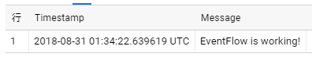

# Mamemaki.EventFlow.Outputs.BigQuery

## Introduction
This is a custom output for [Microsoft.Diagnostics.EventFlow] to insert events into [Google BigQuery].

The general flow of the process:

1. Convert Microsoft.Diagnostics.EventFlow's events([EventData]) to Google BigQuery's rows data([RowsData]) array.
1. If `TableId` has date format strings, expand it.
1. If `AutoCreateTable` enabled, create table if not exists.
1. Call [tabledata().insertAll()] to stream insert rows data into BigQuery with retrying exponential backoff manner.

## Getting Started

To quickly get started, you can create a simple console application in VisualStudio as described below or just download and run [PlayGround](PlayGround) project.

### 0. Preparing setup to use BigQuery

- Prepare Dataset. See [Creating and Using Datasets](https://cloud.google.com/bigquery/docs/datasets)
- Prepare ServiceAccount and set private key json file path to `GOOGLE_APPLICATION_CREDENTIALS` environment variable. See [Authentication](#authentication)

### 1. Install NuGet packages

```powershell
PM> Install-Package Microsoft.Diagnostics.EventFlow.Inputs.Trace
PM> Install-Package Mamemaki.EventFlow.Outputs.BigQuery
PM> Install-Package Microsoft.Diagnostics.EventFlow.Outputs.StdOutput
```

### 2. Add "eventFlowConfig.json"
Add a JSON file named "eventFlowConfig.json" to your project and set the Build Action property of the file to "Copy if Newer". Set the content of the file to the following:

```js
{
  "inputs": [
    {
      "type": "Trace",
      "traceLevel": "Warning"
    }
  ],
  "outputs": [
    {
      "type": "StdOutput"
    },
    {
      "type": "BigQuery",
      "projectId": "xxxxxx-nnnn",
      "datasetId": "xxxxxxxx",
      "tableId": "from_eventflow_{yyyyMMdd}",
      "tableSchemaFile": ".\\tableSchema.json",
      "autoCreateTable": true
    }
  ],
  "schemaVersion": "2016-08-11",
  "extensions": [
    {
      "category": "outputFactory",
      "type": "BigQuery",
      "qualifiedTypeName": "Mamemaki.EventFlow.Outputs.BigQuery.BigQueryOutputFactory, Mamemaki.EventFlow.Outputs.BigQuery"
    }
  ]
}
```

Replace `projectId`, `datasetId` as your environment.

### 3. Add "tableSchema.json"
Add a JSON file named "tableSchema.json" to your project and set the Build Action property of the file to "Copy if Newer". Set the content of the file to the following:

```js
[
  {
    "name": "Timestamp",
    "type": "TIMESTAMP",
    "mode": "REQUIRED"
  },
  {
    "name": "Message",
    "type": "STRING",
    "mode": "REQUIRED"
  }
]
```

### 4. Create an EventFlow pipeline
Create an EventFlow pipeline in your application code using the code below. Run your application and see your traces in console output or in Google BigQuery.
```csharp
    using (var pipeline = DiagnosticPipelineFactory.CreatePipeline("eventFlowConfig.json"))
    {
        System.Diagnostics.Trace.TraceWarning("EventFlow is working!");
        Console.WriteLine("Press any key to exit...");
        Console.ReadKey(intercept: true);
    }
```

Query result in Google BigQuery console:



## Configuration Details

### Output parameters

Parameter  | Description | Required(default)
------------- | ------------- | -------------
`projectId` | Project id of Google BigQuery. | Yes
`datasetId` | Dataset id of Google BigQuery. | Yes
`tableId` | Table id of Google BigQuery. The string enclosed in brackets can be expanded through DateTime.Format(). e.g. "accesslog_{yyyyMMdd}" => accesslog_20181231 | Yes
`autoCreateTable` | If set true, check table exsisting and create table dynamically. see [Dynamic table creating](#dynamic-table-creating). | No(false)
`tableSchemaFile` | Json file that define Google BigQuery table schema. | Yes
`insertIdFieldName` | The field name of InsertId. If set `%uuid%` generate uuid each time. if not set InsertId will not set. see [Specifying insertId property](#specifying-insertid-property). | No(null)

See [Quota policy](https://cloud.google.com/bigquery/streaming-data-into-bigquery#quota)
a section in the Google BigQuery document.

### Authentication

This library refers Application Default credentials([ADC](https://developers.google.com/identity/protocols/application-default-credentials)). You can use `GOOGLE_APPLICATION_CREDENTIALS` environment variable to set your ServiceAccount key. See https://cloud.google.com/docs/authentication/getting-started

Your ServiceAccount need permissions as bellow

- `bigquery.tables.updateData`
- `bigquery.tables.create` if use `autoCreateTable`

### Table id formatting

`tableId` accept [DateTime.ToString()] format to construct table id.
Table id's formatted at runtime using the UTC time.

For example, with the `tableId` is set to `accesslog_{yyyyMM01}`, table ids `accesslog_20181101`, `accesslog_20181201` and so on.

Note that the timestamp of logs and the date in the table id do not always match,
because there is a time lag between collection and transmission of logs.

### Table schema

There is one method to describe the schema of the target table.

1. Load a schema file in JSON.

On this method, set `tableSchemaFile` to a path to the JSON-encoded schema file which you used for creating the table on BigQuery. see [table schema] for detail information.

Example:
```json
[
  {
    "name": "Timestamp",
    "type": "TIMESTAMP",
    "mode": "REQUIRED"
  },
  {
    "name": "FormattedMessage",
    "type": "STRING",
    "mode": "REQUIRED"
  }
]
```

### Specifying insertId property

BigQuery uses `insertId` property to detect duplicate insertion requests (see [data consistency](https://cloud.google.com/bigquery/streaming-data-into-bigquery#dataconsistency) in Google BigQuery documents).
You can set `insertIdFieldName` option to specify the field to use as `insertId` property.

If set `%uuid%` to `insertIdFieldName`, generate uuid each time.

### Dynamic table creating

When `autoCreateTable` is set to `true`, check to exists the table before insertion, then create table if does not exist. When table id changed, do this sequence again. In other words, no table existing check occurred if not change table id.

### Lookup field value

To find the value corresponding to the BigQuery table field from [EventData], we use the following process.

1. Find matching name from common [EventData] properties.
1. Find matching name from Payloads.
1. Error if field mode is "REQUIRED", else will not set the field value.

Supported common [EventData] properties:

Name | Description | Data type
------------- | ------------- | -------------
`Timestamp` | Timestamp of the event | TIMESTAMP
`ProviderName` | Provider name | STRING
`Level` | Level of the event | INTEGER
`Keywords` | Keywords for the event | INTEGER

NOTE: [EventData] value's data type and BigQuery table field's data type must be matched too.

## References

* [Google BigQuery]
* [fluent-plugin-bigquery](https://github.com/kaizenplatform/fluent-plugin-bigquery)
* [.NET アプリから BigQuery に Streaming Insert する方法](http://tech.tanaka733.net/entry/streaming-insert-into-bigquery-from-dotnet)


[Microsoft.Diagnostics.EventFlow]: https://github.com/Azure/diagnostics-eventflow
[EventData]: https://github.com/Azure/diagnostics-eventflow#eventdata-class
[Google BigQuery]: https://cloud.google.com/bigquery/
[RowsData]: https://googlecloudplatform.github.io/google-cloud-dotnet/docs/Google.Cloud.BigQuery.V2/api/Google.Apis.Bigquery.v2.Data.TableDataInsertAllRequest.RowsData.html
[tabledata().insertAll()]: https://cloud.google.com/bigquery/docs/reference/rest/v2/tabledata/insertAll
[table schema]: https://cloud.google.com/bigquery/docs/reference/v2/tables#schema
[DateTime.ToString()]: https://msdn.microsoft.com/en-us/library/vstudio/zdtaw1bw(v=vs.100).aspx
